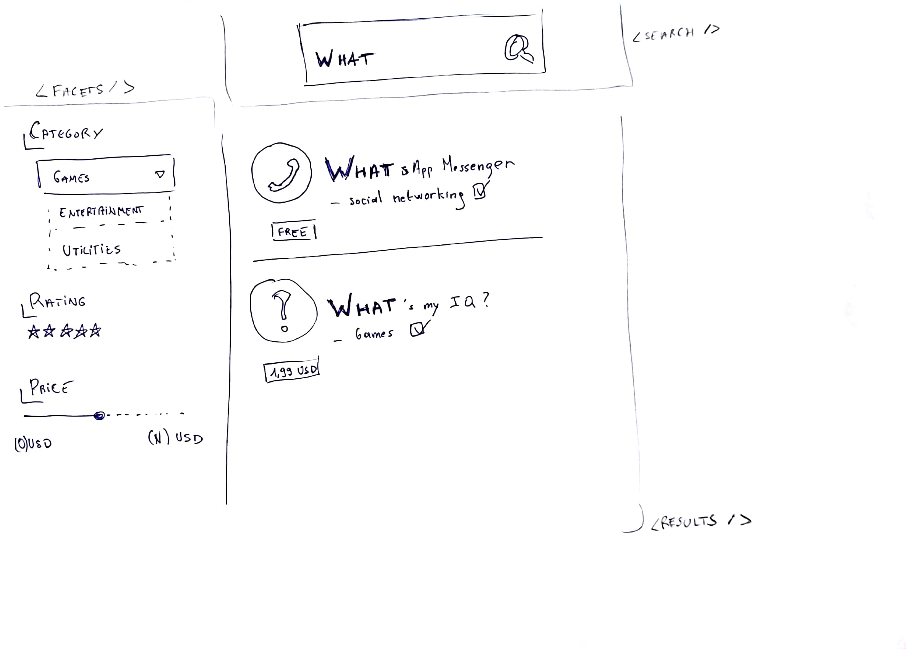
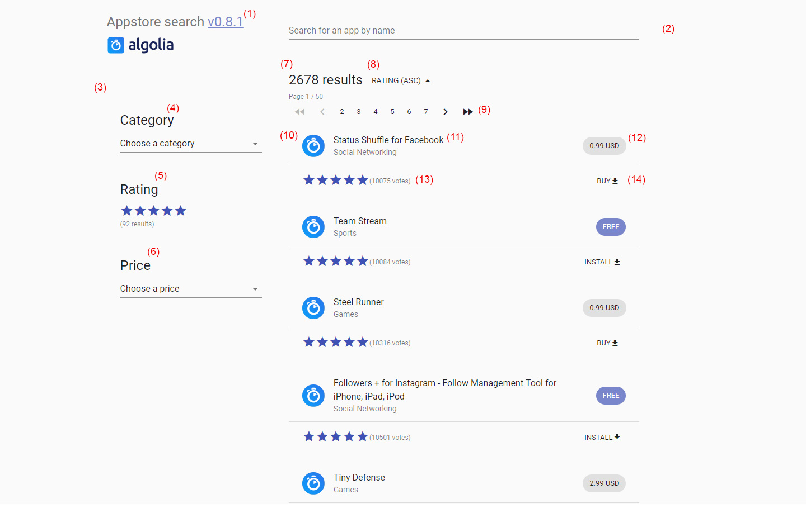

# Algolia appstore APP

[](https://travis-ci.org/baptooo/algolia-appstore)

- [Demonstration](#demonstration)
- [Getting started](#getting-started)
    - [Installation](#installation)
    - [Run the projects](#run-the-projects)
- [Presentation](#presentation)
    - [Project structure](#project-structure)
    - [Backend](#backend)
        - [Rest API](#rest-api)
            - [Create](#create)
            - [Read](#read)
            - [Delete](#delete)
        - [Technical architecture](#backend-technical-architecture)
    - [Frontend](#frontend)
        - [Design / Interface](#design--interface)
        - [Technical architecture](#frontend-technical-architecture)
        - [Continuous integration](#continuous-integration)
        - [Unit tests](#unit-tests)
        - [Release](#release)

# Demonstration

You can view the frontend project here on surge : [brc-algolia-appstore.surge.sh](https://brc-algolia-appstore.surge.sh/)

# Getting started

## Installation

1. Clone the repo

```sh
$ git clone git@github.com:baptooo/algolia-appstore.git
```

2. Install the dependencies

```sh
$ yarn | npm install
```

## Run the projects

**Backend**

You can **run the backend project** with the following command:

```sh
$ yarn api
```

This will run the server locally on the port **5000**

In order to test it, you will find a configuration file [algolia.postman_collection.json](./server/algolia.postman_collection.json)
for the tool [postman](https://www.getpostman.com/) that you can get for free.

**Frontend**

You can **run the frontend project** with the following command:

```sh
$ yarn start
```

This will run the server locally on the port **3000**

**Unit tests**

Run the **unit tests** with the following command:

```sh
$ yarn test
```

# Presentation

This project is done for the [algolia assignment](https://gist.github.com/vvo/08850adfc3736869f04bcf5586418add#-pointers) for **JavaScript Open Source Software Engineer**

### Project structure

**Backend** files are located in `./server`

**Frontend** files are located in `./src`

## Backend

### Rest API

The API is hosted locally on port 5000 [localhost:5000](http://localhost:5000)

It has the 3 following action 

#### Create

Method: **POST**

Path: `/api/1/apps`

Body:

```json
{
  "category": "Games",
  "rating": 5,
  "name": "Foobar",
  "image": "",
  "link": "",
  "ratingCount": 100,
  "price": "0 USD"
}
```

Response:
```json
{
  "objectID": "123456"
}
```

#### Read

Method: **GET**

Path: `/api/1/apps`

Query: `?term=noresult`

Response:
```json
{
    "hits": [],
    "nbHits": 0,
    "page": 0,
    "nbPages": 0,
    "hitsPerPage": 20,
    "processingTimeMS": 1,
    "exhaustiveNbHits": true,
    "query": "noresult",
    "params": "query=noresult"
}
```

#### Delete

Method: **DELETE**

Path: `/api/1/apps/:id`

Query: `/123456`

Response:
```json
{
    "deletedAt": "2018-04-27T13:31:10.181Z",
    "taskID": 950141762,
    "objectID": "123456"
}
```

### Backend technical architecture

The backend application is written in Javascript with NodeJS. It uses the framework [ExpressJs](http://expressjs.com/) to manage the HTTP requests

Every request performs an API call to Algolia thanks to [algoliasearch](https://www.algolia.com/doc/api-client/javascript/getting-started/)

## Frontend

### Design / interface

Starting from a very simple sketch on a piece of paper...



Discovering algolia API's while doing this assignment made me redraw some of the items and enhance some of them.

**Now**



The interface has evolved a little bit, here is a quick description of its functionality and behaviours:

1. This link brings to the latest release note on the github repository
2. Type anything in the research field and it will call Algolia for every character you type (component [Search](./src/components/Search.js))
3. This is the component [Facets](./src/components/Facets.js) that will create every facet component
4. This is the component [SelectFacet](./src/components/facets/SelectFacet.js) that aims to let the user filters the data using a select,
in this case it is used for the **category** facet
5. This is the component [RatingFacet](./src/components/facets/RatingFacet.js) that aims to filter the results with a desired rating.
The filter will be applied **from 0 to the selected value**.
Also, while hovering the stars with a mouse, it will show the count of results per rate.
6. Same as 4. but for the facet **price**
7. This is the component [Controls](./src/components/Controls.js) that simply displays the number of results every time an API call is done.
When the research is to specific and there is no result, it will show a button to reset the facets.
8. This is the component [Results](./src/components/Results.js) that shows the list of results
9. This is an avatar of the application. There is an **error handler** on it and if the loading fails, it will show a placeholder (the algolia logo)
10. This text block shows the name and the category of the current app
11. The price is displayed and if it costs **0 USD** a mention **FREE** is written instead.
12. The rate of the current app with the count of votes in parenthesis
13. This button brings to the link of the app. If the current app is free, a mention **INSTALL** will be written instead of **BUY**

### Frontend technical architecture

The frontend application is built with the generator [create-react-app](https://github.com/facebook/create-react-app)

It takes benefit of the library [material-ui](https://www.material-ui.com/#/) to have strong and efficient components
that respects Accessibility and UX / UI standards erected by [material-design](https://material.io/guidelines/)

All the API calls are done by the library [algolia-research-helper](https://community.algolia.com/algoliasearch-helper-js/)

**About performance**

At build time, the application is rendered statically with a chromium headless browser thanks to the library [react-snap](https://github.com/stereobooster/react-snap)
It allows to have a good [First meaningful paint](https://developers.google.com/web/tools/lighthouse/audits/first-meaningful-paint) which is a very
important notion for user experience especially on mobile.

### Continuous integration

A job is configured thanks to [Tracis CI](https://travis-ci.org/baptooo/algolia-appstore) which will run for every modification and for two cases:

**General case**

Whenever a modification is pushed to github, travis will run a job that will do the following tasks:
- lint sources
- run unit tests
- build the application

**Deploy case**

This case chains up with the general one but will perform the deployment on [https://surge.sh](https://brc-algolia-appstore.surge.sh/)

### Unit tests

There is two kind of tests in the application: **APIs** and **Components**

**APIs**

It ensures the requirements of the UI through the calls done to Algolia.

**Components**

Is uses [test renderer](https://reactjs.org/docs/test-renderer.html) in order to create snapshots of the components.
This will help preventing any regression or undesired changes on the UI part.

### Release

When a bump is done on the project's version there is a **CHANGELOG** generated automatically thanks to the library [generate-changelog](https://github.com/lob/generate-changelog)

Then it is added manually to the tag reference in the github interface [see example for v0.7.0](https://github.com/baptooo/algolia-appstore/releases/tag/v0.7.0)